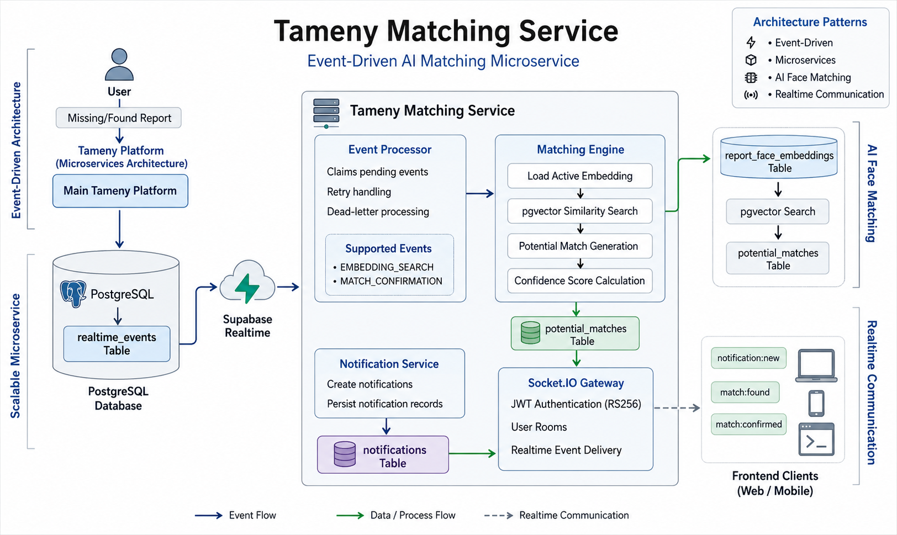

# Tameny Matching Service


**Tameny Matching Service** is an event-driven AI microservice responsible for face similarity matching within **Tameny**, a missing-person identification platform built using a microservices architecture.

It consumes report events from PostgreSQL via Supabase Realtime, performs vector similarity searches using pgvector, persists potential matches, generates user-facing notifications, and delivers realtime updates through authenticated Socket.IO connections.

## Table of Contents

- [Overview](#overview)
- [Key Features](#key-features)
- [Why This Service Exists](#why-this-service-exists)
- [Tech Stack](#tech-stack)
- [Architecture](#architecture)
- [Event Processing](#event-processing)
- [AI Face Matching](#ai-face-matching)
- [Realtime Communication](#realtime-communication)
- [Database Tables](#database-tables)
- [Environment Variables](#environment-variables)
- [Project Structure](#project-structure)
- [Installation](#installation)
- [Development Scripts](#development-scripts)
- [Operational Notes](#operational-notes)
- [License](#license)

## Overview

When a user creates a missing or found report, the main platform stores the report data and face embedding, then inserts an event into `realtime_events`. This service reacts to that event asynchronously.

At a high level, it:

- Authenticates Socket.IO clients with RS256 JWTs.
- Subscribes to inserts on `public.realtime_events`.
- Claims pending or failed events in batches.
- Sends a report-created notification for new report embedding events.
- Runs pgvector cosine similarity search against the opposite report type.
- Stores deduplicated rows in `potential_matches`.
- Creates user-facing notifications in `notifications`.
- Emits realtime socket events to private `user:{userId}` rooms.
- Retries failed events and marks exhausted events as `DEAD`.

This service is intentionally designed as an event-driven worker and realtime communication service. Business operations are handled by other platform services. Express is used for server bootstrap, JSON parsing, development logging, and global 404/error handling while Socket.IO and the database event worker do the main work.

## Key Features

- Event-driven architecture using PostgreSQL and Supabase Realtime
- AI face similarity matching with pgvector
- Realtime notifications via Socket.IO
- RS256 JWT authentication for socket connections
- Retry and dead-letter event processing
- Deduplicated match persistence
- Horizontally scalable event consumption with FOR UPDATE SKIP LOCKED

## Why This Service Exists

The matching process is computationally expensive and asynchronous by nature.

Instead of performing face matching inside the main application request lifecycle, Tameny delegates the operation to a dedicated matching microservice.

Benefits:

- Faster user-facing response times.
- Independent scaling of matching workloads.
- Better fault isolation.
- Reliable event-driven processing.

## Tech Stack

- **Node.js >= 22**
- **JavaScript ES Modules**
- **Express 5**
- **PostgreSQL**
- **pgvector** for embedding similarity search
- **Supabase Realtime** via `@supabase/supabase-js`
- **Socket.IO 4**
- **jsonwebtoken** for RS256 token verification
- **pnpm** as the package manager

## Architecture

<p align="center">
  
</p>

The diagram illustrates the complete event-driven workflow of the Tameny Matching Service, including event processing, AI face matching, notification generation, and realtime communication.

### Main Modules

| Module                                 | Responsibility                                                                             |
| -------------------------------------- | ------------------------------------------------------------------------------------------ |
| `server.js`                            | Loads config, creates the HTTP server, initializes DB, sockets, and the realtime listener. |
| `app.js`                               | Configures Express middleware, JSON parsing, 404 handling, and global error handling.      |
| `src/events/postgresListener.js`       | Subscribes to `INSERT` events on `public.realtime_events` using Supabase Realtime.         |
| `src/events/events.processor.js`       | Claims event rows, dispatches handlers, marks events done, failed, or dead.                |
| `src/services/matching.service.js`     | Loads embeddings, finds matches, saves potential matches, and handles confirmation events. |
| `src/services/notification.service.js` | Inserts notifications and emits `notification:new`.                                        |
| `src/services/socket.service.js`       | Coordinates notification creation with domain socket events.                               |
| `src/sockets/socket.js`                | Creates the Socket.IO server, configures CORS, auth middleware, and connection handlers.   |
| `src/sockets/middleware/socketAuth.js` | Verifies Socket.IO JWTs and stores the decoded user on `socket.data.user`.                 |

## Event Processing

Events are read from the `realtime_events` table. The listener subscribes to:

```js
{
  event: 'INSERT',
  schema: 'public',
  table: 'realtime_events'
}
```

When a new row is inserted, the service calls `processPendingEvents()`. The processor claims up to 10 events with `event_status` of `PENDING` or `FAILED` while `retry_count < 5`.

```sql
UPDATE realtime_events
SET event_status = 'PROCESSING'
WHERE id IN (
  SELECT id FROM realtime_events
  WHERE event_status IN ('PENDING', 'FAILED')
    AND retry_count < 5
  ORDER BY created_at
  FOR UPDATE SKIP LOCKED
  LIMIT 10
)
RETURNING *;
```

### Supported Event Types

| Event Type           | Current Behavior                                                                           |
| -------------------- | ------------------------------------------------------------------------------------------ |
| `EMBEDDING_SEARCH`   | Creates a `REPORT_CREATED` notification, then runs face matching for the report payload.   |
| `MATCH_CONFIRMATION` | Creates a `MATCH_CONFIRMED` notification and emits confirmation to the found report owner. |

Unknown event types are logged by the processor. Because the handler returns normally after logging, they are currently marked as `DONE`.

### Retry Lifecycle

```text
PENDING → PROCESSING → DONE
                ↓
             FAILED → retry on next processing run
                ↓
              DEAD after 5 failed attempts
```

Failed events increment `retry_count`. When `retry_count + 1 >= 5`, the event is marked as `DEAD`.

## AI Face Matching

`matching.service.js` handles the face matching workflow for `EMBEDDING_SEARCH` payloads.

Expected event payload fields include:

```json
{
  "reporterUserId": 77,
  "reportId": 124,
  "reportType": "MISSING",
  "reportedPersonImageUrl": "https://example.com/report-image.jpg",
  "reportedPersonName": "Unknown",
  "reportedPersonGender": "male"
}
```

The service:

1. Reads the active embedding from `report_face_embeddings` for `reportId`.
2. Chooses the opposite search type:
   - `MISSING` reports search active `FOUND` embeddings.
   - `FOUND` reports search active `MISSING` embeddings.
3. Uses `MATCH_THRESHOLD` or `0.6`.
4. Uses `MATCH_LIMIT` or `5`.
5. Runs a pgvector cosine-distance query.
6. Inserts normalized missing/found pairs into `potential_matches`.
7. Emits notifications and socket events only for newly inserted match rows.

The core similarity condition is:

```sql
AND rfe.status = 'ACTIVE'
AND rfe.report_type = $3
AND (rfe.embedding <=> $1) < (1 - $4::double precision)
ORDER BY rfe.embedding <=> $1 ASC
```

The similarity score is calculated as:

```text
1 - cosine_distance
```

For user-facing top scores, the service formats the value as a percentage with one decimal place.

### Match Persistence

Potential matches are stored as normalized report pairs:

```text
missing_report_id + found_report_id + confidence_score + status
```

The insert uses duplicate protection:

```sql
ON CONFLICT (missing_report_id, found_report_id) DO NOTHING
```

Only rows returned from the insert are treated as new matches for notification purposes.

## Realtime Communication

Socket.IO is initialized with:

- `origin: process.env.CLIENT_URL || true`
- `credentials: true`
- `pingTimeout: 20000`
- `pingInterval: 25000`

Clients authenticate by sending a JWT in the Socket.IO handshake auth object:

```js
io('<server-url>', {
  auth: {
    token: '<jwt>',
  },
});
```

The token is verified with:

- Algorithm: `RS256`
- Issuer: `auth-service`
- Public key file: `src/utils/auth/publicKey.pem`

After authentication, each socket joins:

```text
user:{userId}
```

All user-targeted events are emitted to that private room.

### Realtime Events

| Event              | Emitted By                | Purpose                                            |
| ------------------ | ------------------------- | -------------------------------------------------- |
| `notification:new` | `notification.service.js` | Sent after any notification row is inserted.       |
| `match:found`      | `socket.service.js`       | Sent when new potential matches are found.         |
| `match:confirmed`  | `socket.service.js`       | Sent when a match confirmation event is processed. |

`report:created` exists in `src/sockets/utils/constants.js`, but the current flow sends report creation to clients as a persisted `REPORT_CREATED` notification through `notification:new`.

### `notification:new` Payload

The payload is the notification row returned from PostgreSQL:

```json
{
  "id": 982,
  "user_id": 77,
  "notification_type": "MATCH_FOUND",
  "title": "Potential match found",
  "body": "A possible match was found for your report.",
  "payload": {
    "reportId": 124,
    "totalMatches": 2,
    "topConfidenceScore": 91.4,
    "foundReportImageUrl": "https://example.com/found.jpg"
  },
  "created_at": "2026-05-09T10:30:05.000Z"
}
```

Notification titles and bodies are currently created inside `notification.service.js`.

### `match:found` Payload

For a missing report that matches found reports:

```json
{
  "type": "match:found",
  "reportId": 124,
  "totalMatches": 2,
  "topConfidenceScore": 91.4,
  "foundReportImageUrl": "https://example.com/found-456.jpg",
  "matches": [
    {
      "reportId": 456,
      "confidenceScore": 0.914,
      "missingUserId": null,
      "reportedPersonImageUrl": "https://example.com/found-456.jpg",
      "reportedPersonName": "Unknown",
      "reportedPersonGender": "male",
      "createdAt": "2026-05-09T10:30:00.000Z"
    }
  ]
}
```

For a found report that matches existing missing reports, the service emits to each matched missing report owner. In that branch, each emitted match uses a single-item `matches` array and formats `confidenceScore` as a percentage.

### `match:confirmed` Payload

```json
{
  "type": "match:confirmed",
  "matchedReportId": 456,
  "matchedPersonName": "Ahmed Hassan",
  "matchedPersonImageUrl": "https://example.com/matched-456.jpg"
}
```

## Database Tables

The service expects these database concepts to exist:

| Table                    | Purpose                                                                 |
| ------------------------ | ----------------------------------------------------------------------- |
| `realtime_events`        | Durable event queue consumed by this service.                           |
| `report_face_embeddings` | Stores face embeddings, report IDs, report types, and embedding status. |
| `potential_matches`      | Stores candidate missing/found report pairs and confidence scores.      |
| `notifications`          | Stores user-facing notifications before realtime emission.              |

Important fields used by the current code:

| Table                    | Fields Used                                                                |
| ------------------------ | -------------------------------------------------------------------------- |
| `realtime_events`        | `id`, `event_type`, `event_status`, `payload`, `retry_count`, `created_at` |
| `report_face_embeddings` | `report_id`, `embedding`, `report_type`, `status`                          |
| `potential_matches`      | `missing_report_id`, `found_report_id`, `confidence_score`, `status`       |
| `notifications`          | `user_id`, `notification_type`, `title`, `body`, `payload`                 |

## Environment Variables

Create a `.env` file in the project root.

```env
NODE_ENV=development
PORT=3000

# Client / Socket.IO CORS
CLIENT_URL=http://localhost:5173

# PostgreSQL
DB_HOST=localhost
DB_PORT=5432
DB_NAME=tameny
DB_USER=postgres
DB_PASS=postgres

# Supabase Realtime
SUPABASE_URL=https://your-project.supabase.co
SUPABASE_ANON_KEY=your-supabase-anon-key

# Matching
MATCH_THRESHOLD=0.6
MATCH_LIMIT=5
```

| Variable            | Description                                                                      |
| ------------------- | -------------------------------------------------------------------------------- |
| `NODE_ENV`          | Enables development logging and controls PostgreSQL SSL behavior.                |
| `PORT`              | HTTP and Socket.IO port. Defaults to `3000`.                                     |
| `CLIENT_URL`        | Allowed frontend origin for Socket.IO CORS. If missing, all origins are allowed. |
| `DB_HOST`           | PostgreSQL host.                                                                 |
| `DB_PORT`           | PostgreSQL port.                                                                 |
| `DB_NAME`           | PostgreSQL database name.                                                        |
| `DB_USER`           | PostgreSQL username.                                                             |
| `DB_PASS`           | PostgreSQL password.                                                             |
| `SUPABASE_URL`      | Supabase project URL used by the realtime listener.                              |
| `SUPABASE_ANON_KEY` | Supabase anon key used for the realtime subscription.                            |
| `MATCH_THRESHOLD`   | Minimum cosine similarity score. Defaults to `0.6`.                              |
| `MATCH_LIMIT`       | Maximum candidate matches returned per search. Defaults to `5`.                  |

When `NODE_ENV=production`, the PostgreSQL pool enables SSL with `rejectUnauthorized: false`.

## Project Structure

```text
.
├── app.js
├── server.js
├── package.json
├──src/
│    ├── config/
│    │   ├── db.config.js
│    │   └── dotenv.js
│    ├── db/
│    │   ├── initDB.js
│    │   └── pool.js
│    ├── events/
│    │   ├── events.processor.js
│    │   └── postgresListener.js
│    ├── middlewares/
│    │   └── globalErrorHandler.js
│    ├── services/
│    │   ├── matching.service.js
│    │   ├── notification.service.js
│    │   └── socket.service.js
│    ├── sockets/
│    │   ├── handlers/
│    │   ├── middleware/
│    │   ├── utils/
│    │   └── socket.js
│    └── utils/
│         ├── auth/
└         └── error/
```

## Installation

### 1. Install dependencies

```bash
pnpm install
```

### 2. Configure environment variables

Create `.env` and fill in the required PostgreSQL, Supabase, Socket.IO, and matching values.

Make sure `src/utils/auth/publicKey.pem` matches the private key used by the authentication service that issues Socket.IO tokens.

### 3. Run the service

Development:

```bash
pnpm dev
```

Production:

```bash
pnpm start
```

The service starts the HTTP server, initializes Socket.IO, checks PostgreSQL connectivity, and subscribes to `realtime_events` inserts.

## Development Scripts

| Command      | Description                                      |
| ------------ | ------------------------------------------------ |
| `pnpm dev`   | Run with `NODE_ENV=development` using `nodemon`. |
| `pnpm start` | Run `server.js` with Node.js.                    |
| `pnpm prod`  | Run with `NODE_ENV=production` using `nodemon`.  |
| `pnpm debug` | Start with `ndb`.                                |

There is no automated test script currently defined in `package.json`.

## Operational Notes

- Existing `PENDING` or `FAILED` events are processed when `processPendingEvents()` runs. In the current runtime, that happens when Supabase Realtime receives a new insert on `realtime_events`.
- Multiple service instances can process events safely because event claiming uses `FOR UPDATE SKIP LOCKED`.
- Keep a unique constraint on `(missing_report_id, found_report_id)` in `potential_matches` so duplicate prevention works.
- Add pgvector indexes as embedding volume grows.
- Monitor `DEAD` events because they indicate repeated processing failures or invalid payloads.
- The service logs socket connections and disconnections, but it does not currently use structured logging or tracing.

## License

This project is licensed under the **MIT License**.
